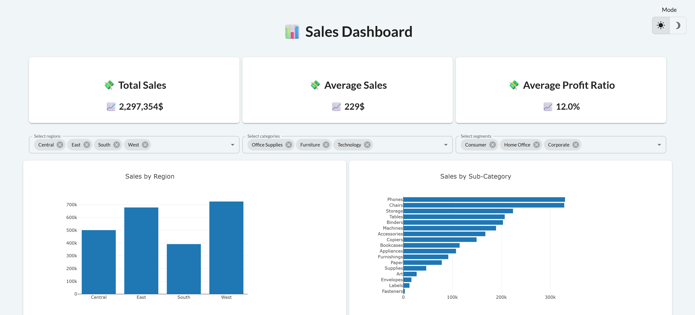

# Sales Dashboard

This project is a sales dashboard built using Python, Pandas, and Taipy GUI. The dashboard allows users to filter sales data by region, category, and segment, and visualizes the results through various charts and metrics.



## Installation
1. Clone this repository:
    ```sh
    git clone https://github.com/sixthnovember/Sales-Dashboard.git
    cd Sales-Dashboard
    ```
2. Install the required packages:
    ```sh
    pip install -r requirements.txt
    ```
3. Run the application:
    ```sh
    python app.py
    ```

## Usage
1. Open your web browser and navigate to the local address where Streamlit is running, typically `http://127.0.0.1:5000/`.
2. Use the filter selectors to choose specific regions, categories, and segments.
3. View the updated metrics and charts based on your filter selections.